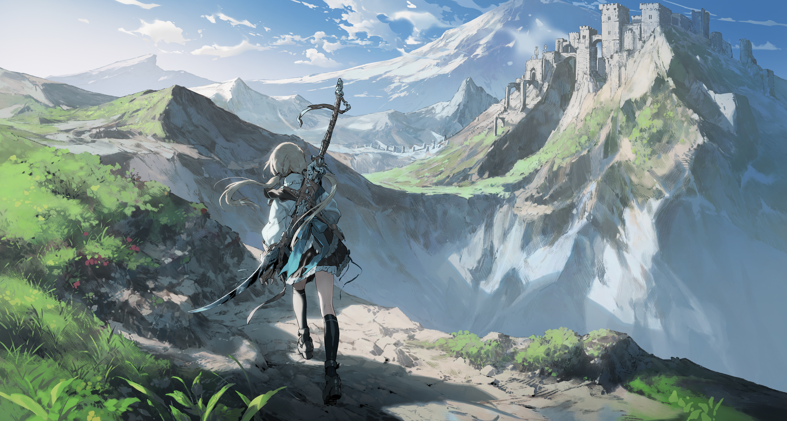
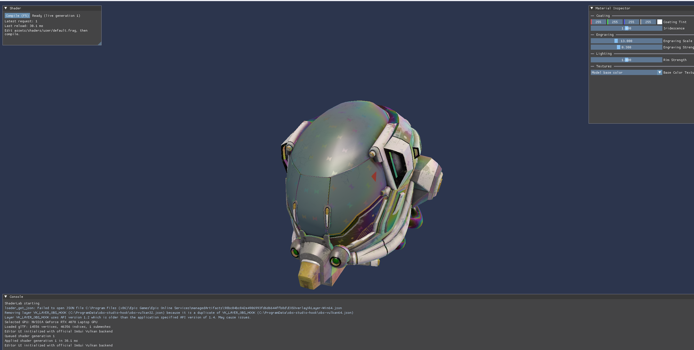
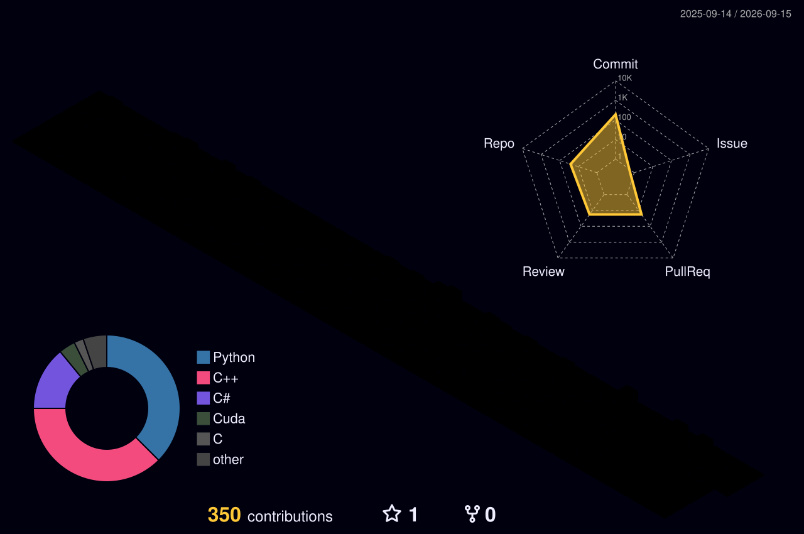

  

<h1 align="center">Hi, I'm tyduc45</h1>

  

## About Me

- Computer Science student at **The Australian National University (ANU)**
- Interested in **computer graphics**, **real-time rendering**, and **GPU programming**
- Programming with **C/C++**, **Python**, and **C#**
- Currently exploring graphics APIs, rendering systems, and performance-oriented computing

## Tech Stack

  

  
  
  
  
  

## Featured Projects

### [ShaderLab](https://github.com/tyduc45/shaderlab) · In Progress

A Windows Vulkan 1.4 shader authoring tool written in C++. It supports glTF model loading, an ImGui-based editor interface, and an iterative shader compilation workflow.

`C++` `Vulkan 1.4` `GLSL` `ImGui` `CMake` `vcpkg`

<table>
  <tr>
    <td width="50%" valign="top">
      <h3><a href="https://github.com/tyduc45/sgemm_optimization_log">CUDA SGEMM Optimization</a></h3>
      
Experiments with CUDA SGEMM kernels, focusing on GPU programming and performance-oriented matrix multiplication.

      
<code>CUDA</code> <code>C++</code> <code>CMake</code>

    </td>
    <td width="50%" valign="top">
      <h3><a href="https://github.com/tyduc45/ray-tracing-acc-research">Ray Tracing Acceleration Research</a></h3>
      
A Unity compute-shader ray tracer exploring BVH construction and accelerated ray/mesh intersection.

      
<code>Unity</code> <code>C#</code> <code>Compute Shader</code> <code>BVH</code>

    </td>
  </tr>
</table>

## GitHub Activity

  
  

  

